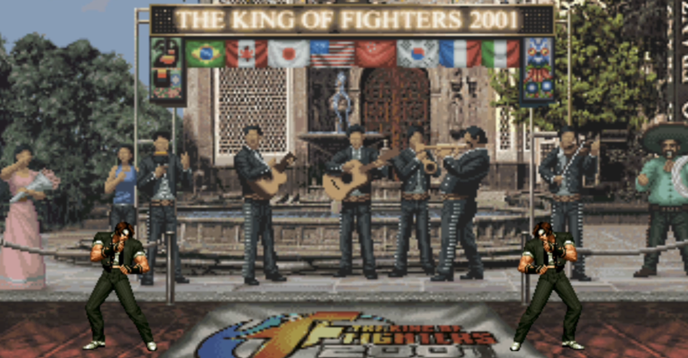
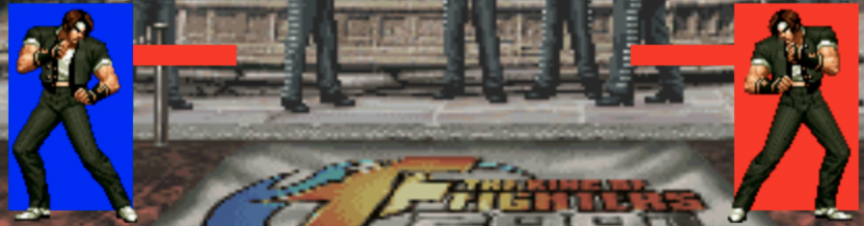

<h1 align="center">King of Fighters</h1>



<h2 align="center"><a  href="https://youtu.be/HRxvA9wOfb8">View a Demo</a></h2>

## Description


<p align="center">
</p>

A horizontal fighting game built with the **Phaser 3** game engine and JavaScript ES6. Two players share a keyboard to fight against each other. The character (Kyo Kusanagi) has four actions and seven states.

> Originally built with CSS, jQuery and the Canvas API; now refactored onto Phaser 3 (Scenes, the Phaser game loop, keyboard input and the texture manager) bundled with Vite.

**The King of Fighters inspires this project** .

## How to play

- **Share** a keyboard.
  | Character Movements | Player 1 |  Player 2  |
  | :-----------------: | :------: | :--------: |
  |        Jump         |    w     |  ArrowUp   |
  |      Go Right       |    d     | ArrowRight |
  |       Go Left       |    a     | ArrowLeft  |
  |    Throw a Punch    |  Space   |   Enter    |
- **Beat** your opponent before the countdown ends.

## About the project

### Phaser 3 architecture

- `PreloadScene` decodes every character/background GIF and registers each frame
  with Phaser's texture manager, then hands off to `FightScene`.
- `FightScene` runs the Phaser game loop, draws the HP-bar / countdown HUD and
  drives the two players.
- `Player` / `Kyo` hold the gameplay logic (movement, state machine, collision)
  and render through a Phaser sprite whose texture is swapped each frame.

### GIF assets

- The original art ships as animated GIFs. A small bundled decoder
  (`src/utils/gif.js`) composites each GIF frame onto a `<canvas>`, which is
  registered as a Phaser texture (`registerGifTextures`) so the existing artwork
  is reused as-is — no asset conversion required.

  <p align="center"></p>

### Finite-state Machine

- A finite-state machine with a state collection, state transitions and a current
  state variable. Together with character variables (initial position, direction,
  speed, gravity, etc.) it gives the character seven smooth animations.
- 0: idle, 1: forward, 2: backward, 3: jump, 4: attack, 5: be hit, 6: death

### UI sound effects

- The menus play short system SFX: `cursor` (move/switch fighter), `select`
  (confirm), `cancel` (un-confirm) and `start` (leave title / FIGHT!).
- `src/audio.js` is the single source of truth — `loadUiSounds()` queues them in
  `PreloadScene` and `playUi(scene, name)` plays them. The browser only unlocks
  audio after a user gesture, so the first sound you hear is `start` on the
  title screen.
- The bundled files in `public/assets/sounds/ui/` are placeholder beeps. To use
  real King of Fighters system rips (or any UI pack), drop your `.wav` files in
  over them keeping the same filenames — no code change needed. Good sources:
  [The Sounds Resource (KOF XV)](https://sounds.spriters-resource.com/pc_computer/thekingoffightersxv/),
  [爱给网 选择角色](https://www.aigei.com/sound/class/xuan_ze_ji/),
  [OpenGameArt GUI sounds](https://opengameart.org/content/gui-sound-effects).

### Collision Detection

- Axis-Aligned Bounding Box collision detection drives attack, hit and death.

<p align="center"></p>


## Project setup

```bash
npm install      # install Phaser 3 + Vite
npm run dev      # start the dev server (opens the game in your browser)
npm run build    # produce a production build in dist/
npm run preview  # preview the production build
```

## Local-only MuleRun Studio API

Start a local HTTP API wrapper for `mulerun studio`:

```bash
npm run local-api
```

The API only listens on `127.0.0.1` by default and uses the existing MuleRun
CLI login/configuration on this machine.

Available routes:

```bash
curl http://127.0.0.1:8787/health

curl -X POST http://127.0.0.1:8787/api/chatgpt-image2 \
  -H 'content-type: application/json' \
  -d '{"prompt":"A cinematic robot panda", "size":"1024x1024"}'

curl -X POST http://127.0.0.1:8787/api/nanobanana-pro \
  -H 'content-type: application/json' \
  -d '{"prompt":"A cinematic robot panda", "aspectRatio":"1:1", "resolution":"1K"}'

curl -X POST http://127.0.0.1:8787/api/seedence \
  -H 'content-type: application/json' \
  -d '{"prompt":"A cinematic robot panda walking in rain", "duration":5, "resolution":"720p"}'
```

You can also call any MuleRun Studio endpoint directly:

```bash
curl -X POST http://127.0.0.1:8787/api/run \
  -H 'content-type: application/json' \
  -d '{"endpoint":"google/nano-banana-pro/generation", "prompt":"A red sports car"}'
```

Optional settings:

```bash
LOCAL_API_PORT=8787 LOCAL_API_HOST=127.0.0.1 npm run local-api
```

## Future scope

- Add other characters.
- Add character skills.
